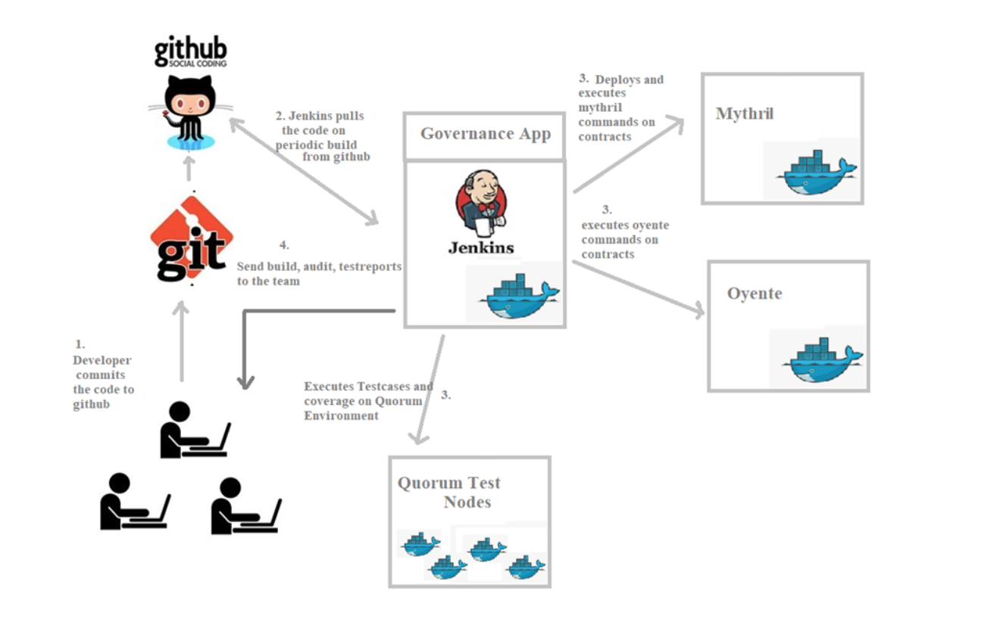

# README
**Introduction**

This document is intended to provide an understanding of Jenkins Continuous integration and Continuous Deployment (CI/CD) mechanism of Ledgerium development project.

**High Level Architecture**

Below is the Jenkins workflow.



In the above diagram, Jenkins,mythril,oyente are dockers containers.

Jenkins from docker needs to communicate with other dockers present in same hierarchy. “Docker in Docker” configuration is done for communication to other docker machines(mythril,oyente).

Mythril, oyente and quorum test nodes are dockers. Jenkins communicates with other dockers and execute commands. The generated reports are forwarded to team.

Mocha tests are executed on Quorum developer setup of governance app from Jenkins and provide reports to the team.

**Steps to Setup CI/CD**

Install docker and docker-compose in hostmachine. 

**Docker installation:**

```curl -fsSL https://download.docker.com/linux/ubuntu/gpg | sudo apt-key add –
sudo add-apt-repository "deb [arch=amd64] https://download.docker.com/linux/ubuntu $(lsb_release -cs) stable"
sudo apt-get update
apt-cache policy docker-ce
sudo apt-get install -y docker-ce
sudo systemctl status docker
```

**Docker compose installation:**

```
sudo curl -L https://github.com/docker/compose/releases/download/1.23.2/docker-compose-`uname -s`-`uname -m` -o /usr/local/bin/docker-compose
sudo chmod +x /usr/local/bin/docker-compose
docker-compose –version
```

**Run and Setup Jenkins docker**
Setup gmail credentials in setup.sh and run below command
```
./setup.sh
```

Following link will be used for setting up node and emails configurations for Jenkins

http://125.254.27.14:28080

Mythril (**mythril/myth docker image**) and oyente (**qspprotocol/oyente-0.4.24 docker image**) dockers are used for security auditing which are configured in jenkin jobs. This scripts trigger docker commands of security audit tools and governance app tools.

Scripts are available at

https://github.com/pravn1729/ledgeriumjenkins

**contract_audit_mythril**

This script is used to run each contract file e.g. AdminSetValidator.sol and SimpleSetValidator.sol against the Mythril which is an open source Ethereum smart contract and dApp (decentralized app) security analysis tool. It sends the email with the link of the static report, available on Jenkins system to dev@ledgerium.net

**contract_audit_oyente**

This script is used to run each contract file e.g. AdminSetValidator.sol and SimpleSetValidator.sol against the Oyente which is another open source static smart contract security analysis tool. It sends the email with the link of the static report, available on Jenkins system to dev@ledgerium.net

**contract_testreport**

This script is used to run mocha tests on AdminSetValidator.sol and SimpleSetValidator.sol.
